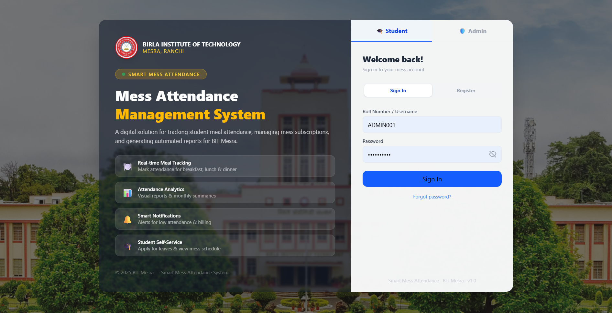
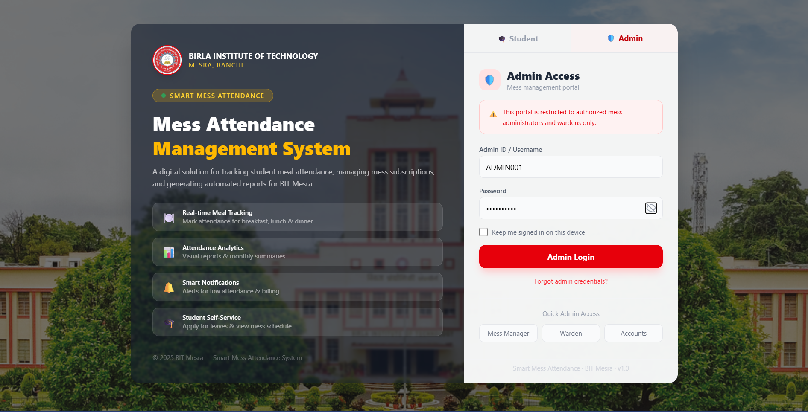
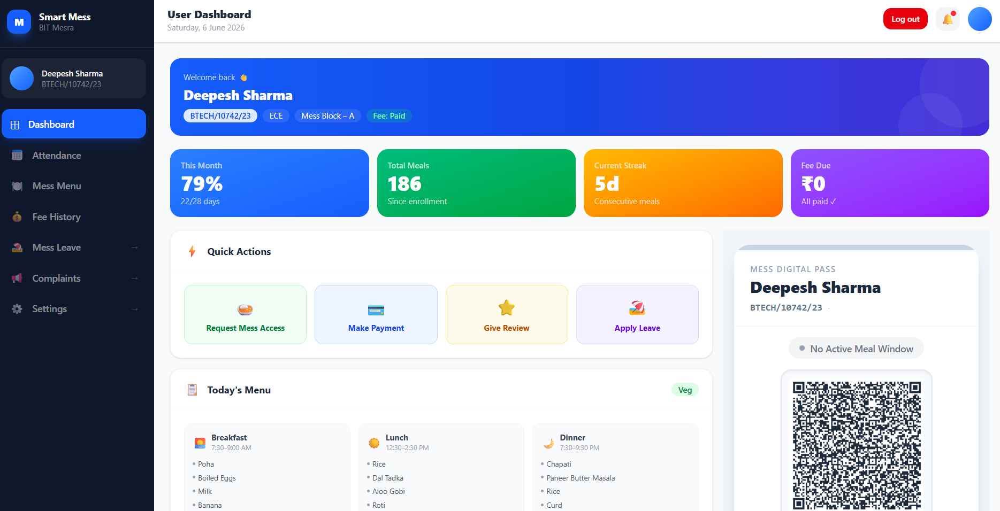
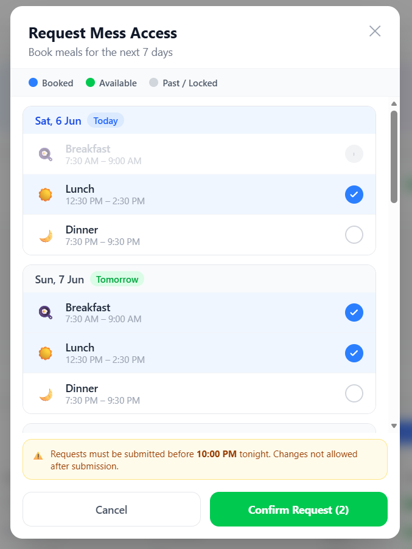
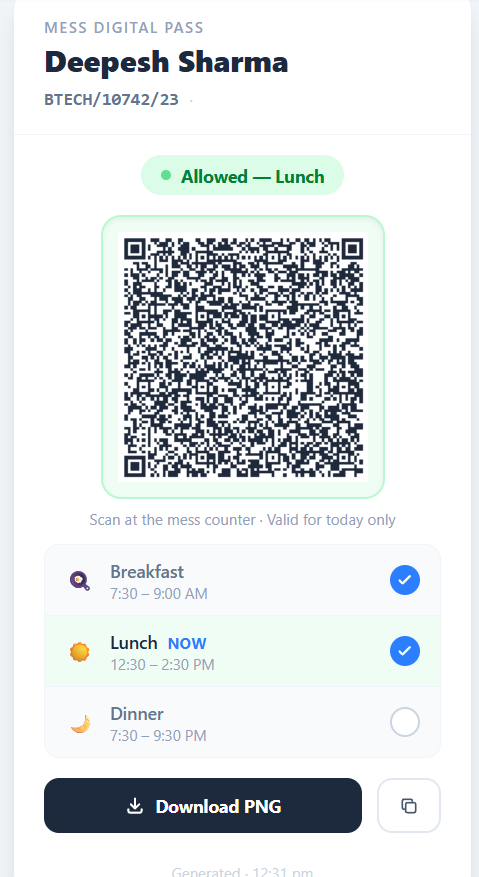
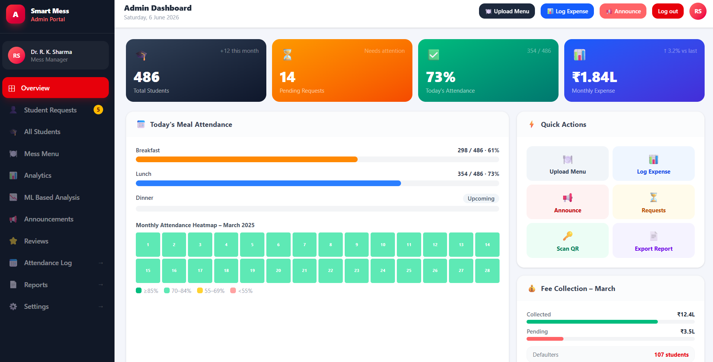
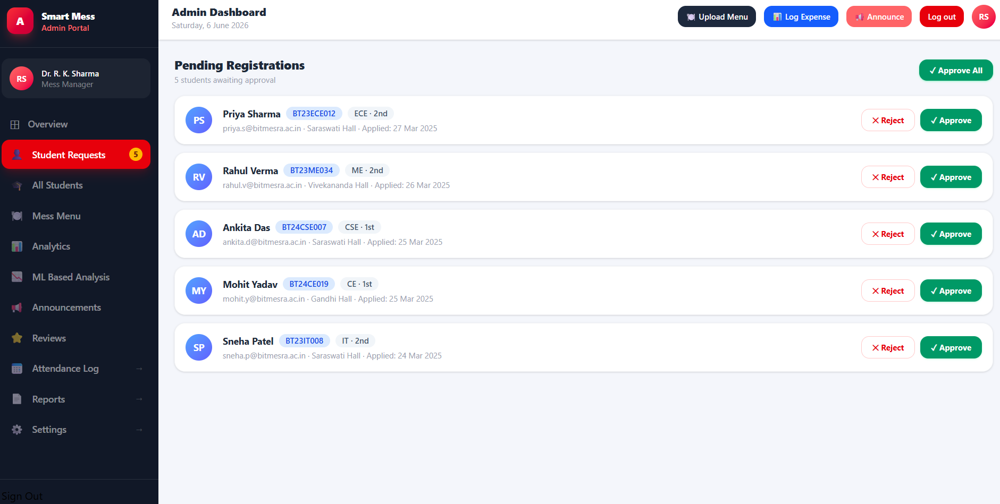
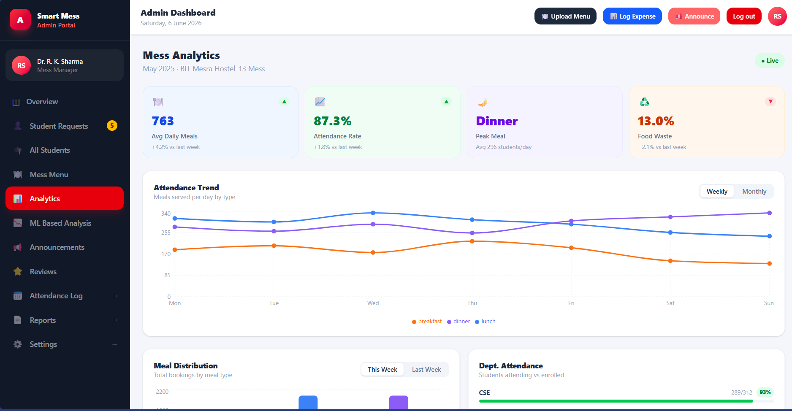
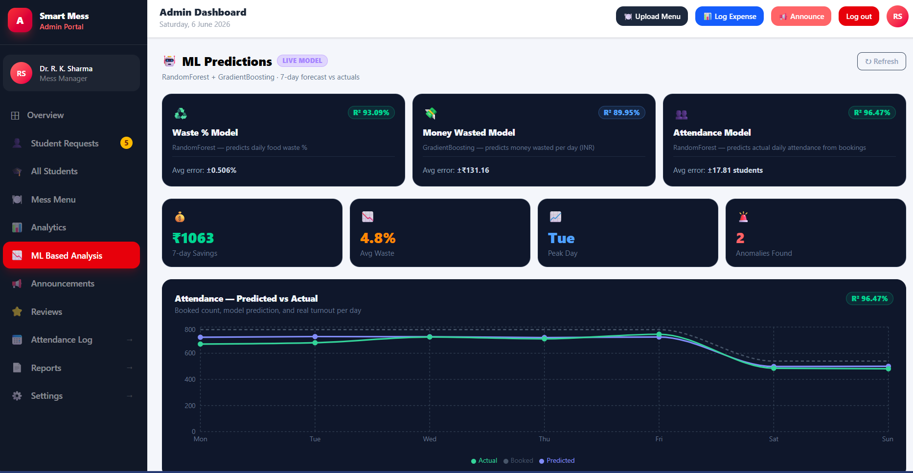

<div align="center">


<br/><br/>


<br/><br/>

# 🍽️ Smart Mess Attendance System

### A full-stack digital solution for hostel mess management at Birla Institute of Technology, Mesra

**Digitizing meal tracking · Automating fee management · Empowering students & administrators**

[Features](#-features) · [Tech Stack](#-tech-stack) · [Getting Started](#-getting-started) · [API Docs](#-api-reference) · [Screenshots](#-screenshots) · [Project Structure](#-project-structure)

</div>

---

## 📌 Overview

**Smart Mess Attendance System** is a production-ready full-stack web application built for BIT Mesra's hostel mess management. It replaces the traditional paper-based attendance and fee tracking system with a modern digital platform that provides real-time insights for administrators and a seamless self-service experience for students.

The system supports two distinct portals — a **Student Portal** for meal tracking, fee payments, and mess requests, and an **Admin Portal** for managing students, uploading menus, logging expenses, and broadcasting announcements — all secured with role-based JWT authentication.

---

## 🖼️ Screenshots

<br/>

### 🔐 Login Page
> _Student login / register and admin login with BIT Mesra campus backdrop_




<br/>

### 🎓 Student Dashboard
> _Personalized student portal with attendance ring, quick actions, and mess card_

<!-- ADD SCREENSHOT: Student dashboard overview with all sections visible -->



<br/>

 
<br/>


<br/>

### 🛡️ Admin Portal
> _Command center for mess administrators with analytics and management tools_




<br/>

<!-- ADD SCREENSHOT: Student registration requests approval panel -->




<br/>





<br/>



<br/>

---

## ✨ Features

### 👨‍🎓 Student Portal
- **Secure Authentication** — Roll number + password login with JWT session management
- **Self Registration** — Students register with full academic details; access granted after admin approval
- **Attendance Dashboard** — Visual donut chart showing monthly attendance % with per-meal breakdown (Breakfast / Lunch / Dinner)
- **Mess Access Requests** — Request meal access for the next day before the 10 PM deadline
- **Digital Mess Card** — QR-style downloadable mess ID card with active status
- **Fee History** — View complete payment history with transaction IDs and payment methods
- **Integrated Payments** — Pay mess fees via UPI, Card, or Net Banking directly from the portal
- **Today's Menu** — See the daily meal menu with timings at a glance
- **Meal Reviews** — Rate and review meals with star ratings and written feedback
- **Notices Board** — Color-coded announcements from mess administration
- **Leave Management** _(page ready)_ — Apply for mess leave with date range selection

### 🛡️ Admin Portal
- **Secure Admin Login** — AdminID + password with shorter JWT expiry for enhanced security
- **Role-Based Access** — Four admin roles: `super_admin`, `mess_manager`, `warden`, `accounts`
- **Student Request Approval** — Review, approve, or reject new student registrations one by one or in bulk
- **Student Management** — Full searchable/filterable table with suspend/activate controls and pagination
- **Weekly Menu Upload** — Day-by-day meal editor with per-meal fields for the entire week
- **Daily Expense Logger** — Log itemized mess expenses by category with running totals and monthly analytics
- **Attendance Heatmap** — Monthly calendar heatmap showing daily attendance % with color-coded severity
- **Fee Collection Tracker** — Visual breakdown of collected vs pending fees with defaulter list and bulk reminder
- **Announcements** — Publish targeted notices to all students or specific year groups with type badges (Info / Warning / Notice)
- **Student Reviews** — View and reply to student meal feedback with rating distribution chart
- **Expense Analytics** — Per-day, per-week, per-month, and per-head expenditure summaries

### 🔒 Security
- Password hashing with **bcryptjs** (12 salt rounds)
- **JWT** with separate expiry for student (7d) and admin (1d) sessions
- **Role-based route protection** on both frontend (React Router guards) and backend (Express middleware)
- **Rate limiting** on all auth endpoints (20 requests / 15 min per IP) to prevent brute-force attacks
- Security headers via **Helmet.js**
- Sensitive fields excluded from DB queries using Mongoose `select: false`
- User enumeration prevention (vague error messages on failed login)

---

## 🛠️ Tech Stack

| Layer | Technology |
|-------|------------|
| **Frontend** | React 18, React Router v6, Tailwind CSS |
| **State / Auth** | React Context API, localStorage |
| **Backend** | Node.js, Express.js |
| **Database** | MongoDB, Mongoose ODM |
| **Authentication** | JSON Web Tokens (JWT), bcryptjs |
| **Security** | Helmet.js, express-rate-limit, CORS |
| **Dev Tools** | Vite, dotenv, nodemon |

---

## 📁 Project Structure

```
smart-mess-attendance/
│
├── frontend/                        # React frontend (Vite)
│   ├── public/
│   └── src/
│       ├── context/
│       │   └── AuthContext.jsx      # Global auth state, login/logout/register
│       ├── components/
│       │   └── ProtectedRoute.jsx   # Role-based route guard
│       ├── pages/
│       │   ├── SmartMessLogin.jsx   # /login  — Student & Admin login + register
│       │   ├── StudentDashboard.jsx # /dashboard — Student portal
│       │   └── AdminDashboard.jsx   # /admin — Admin portal
│       ├── App.jsx                  # Router with protected routes
│       └── main.jsx                 # React entry point
│
├── backend/                         # Express backend
│   ├── middleware/
│   │   └── authMiddleware.js        # JWT protect + role guards
│   ├── database.js                  # All Mongoose schemas & models
│   ├── index.js                     # Express app + all API endpoints
│   ├── seedAdmin.js                 # One-time super admin seed script
│   └── .env                         # Environment variables (not committed)
│
├── .env.example                     # Environment variable template
├── .gitignore
└── README.md
```

---

## 🗄️ Database Schema

The system uses **MongoDB** with **8 Mongoose models**:

| Model | Purpose |
|-------|---------|
| `Student` | Student accounts with status lifecycle (`pending → active → suspended`) |
| `Admin` | Admin accounts with designation-based permissions |
| `Attendance` | Per-student per-day meal attendance (B / L / D) |
| `FeePayment` | Transaction log for mess fee payments |
| `Expense` | Daily itemized mess expense records |
| `Menu` | Weekly meal menu per mess block |
| `Announcement` | Admin broadcasts with audience targeting |
| `Review` | Student meal ratings and admin replies |
| `MessAccess` | Student next-day meal access requests |

---

## 🚀 Getting Started

### Prerequisites

- Node.js v18+
- MongoDB (local) or MongoDB Atlas account
- npm or yarn

### 1. Clone the repository

```bash
git clone https://github.com/your-username/smart-mess-attendance.git
cd smart-mess-attendance
```

### 2. Set up the backend

```bash
cd backend
npm install
```

Copy the environment template and fill in your values:

```bash
cp .env.example .env
```

```env
MONGO_URI=mongodb://localhost:27017/smart_mess
JWT_SECRET=your_super_long_random_secret_here
JWT_EXPIRES_IN=7d
ADMIN_JWT_EXPIRES_IN=1d
PORT=5000
CLIENT_ORIGIN=http://localhost:5173
NODE_ENV=development
```

### 3. Seed the first super admin

```bash
node seedAdmin.js
```

This creates an admin with:
- **Admin ID:** `ADMIN001`
- **Password:** `Admin@1234` _(change this in `seedAdmin.js` before running)_

### 4. Start the backend server

```bash
# Development (with auto-restart)
npx nodemon index.js

# Production
node index.js
```

Server starts at **http://localhost:5000**

### 5. Set up the frontend

```bash
cd ../client
npm install
npm run dev
```

Frontend starts at **http://localhost:5173**

---

## 🔌 API Reference

### Auth — Student

| Method | Endpoint | Auth | Description |
|--------|----------|------|-------------|
| `POST` | `/api/auth/student/register` | Public | Register new student (status: pending) |
| `POST` | `/api/auth/student/login` | Public | Login with `rollNo` + `password` |
| `GET` | `/api/auth/student/me` | Student JWT | Get own profile |

### Auth — Admin

| Method | Endpoint | Auth | Description |
|--------|----------|------|-------------|
| `POST` | `/api/auth/admin/login` | Public | Login with `adminId` + `password` |
| `GET` | `/api/auth/admin/me` | Admin JWT | Get own profile |
| `POST` | `/api/auth/admin/create` | super_admin | Create a new admin account |
| `POST` | `/api/auth/logout` | Any JWT | Invalidate session (client-side) |

### Student Management (Admin only)

| Method | Endpoint | Auth | Description |
|--------|----------|------|-------------|
| `GET` | `/api/admin/students/pending` | Admin | List all pending registrations |
| `PATCH` | `/api/admin/students/:id/approve` | Admin | Approve a pending student |
| `PATCH` | `/api/admin/students/:id/reject` | Admin | Reject and remove a pending student |
| `PATCH` | `/api/admin/students/:id/suspend` | Admin | Toggle student suspend / active |
| `GET` | `/api/admin/students` | Admin | All students (search, filter, paginate) |

### Request Format

All requests that require authentication must include:
```
Authorization: Bearer <your_jwt_token>
```

### Response Format

All responses follow a consistent structure:
```json
{
  "success": true,
  "message": "Human-readable message",
  "data": { },
  "token": "jwt_token_on_login_only"
}
```

---

## 🔐 Authentication Flow

```
Student Register → status: "pending"
                       ↓
              Admin reviews request
                       ↓
              Admin approves → status: "active"
                       ↓
              Student can now login → JWT issued → /dashboard


Admin Login → adminId + password → JWT issued (1d expiry) → /admin
```

---

## 🛡️ Route Protection

| Route | Guard | Redirect if unauthorized |
|-------|-------|--------------------------|
| `/login` | Public (bounces logged-in users) | → `/dashboard` or `/admin` |
| `/dashboard` | Student JWT required | → `/login` |
| `/admin` | Admin JWT required | → `/login` |
| Any unknown route | — | → `/` (smart redirect) |

---

## 🔮 Roadmap

- [ ] Real-time attendance marking via QR code scan
- [ ] Email & SMS notifications for fee reminders and approvals
- [ ] Monthly PDF report generation and export
- [ ] Mess leave application with date-range picker
- [ ] Student complaints and resolution tracking
- [ ] Push notifications for new menu and announcements
- [ ] Mobile app (React Native)
- [ ] Admin analytics dashboard with Chart.js graphs
- [ ] Bulk attendance import via Excel/CSV

---

## 🤝 Contributing

Contributions, issues, and feature requests are welcome!

1. Fork the repository
2. Create your feature branch: `git checkout -b feature/amazing-feature`
3. Commit your changes: `git commit -m 'feat: add amazing feature'`
4. Push to the branch: `git push origin feature/amazing-feature`
5. Open a Pull Request

Please make sure your code follows the existing style and all endpoints are tested before submitting a PR.

---

## 📄 License

This project is licensed under the **MIT License** — see the [LICENSE](LICENSE) file for details.

---

## 👨‍💻 Author

**Developed for BIT Mesra Hostel Mess Management**

> Built with ❤️ using the MERN stack

---

<div align="center">

⭐ **If this project helped you, please give it a star!** ⭐

</div>
